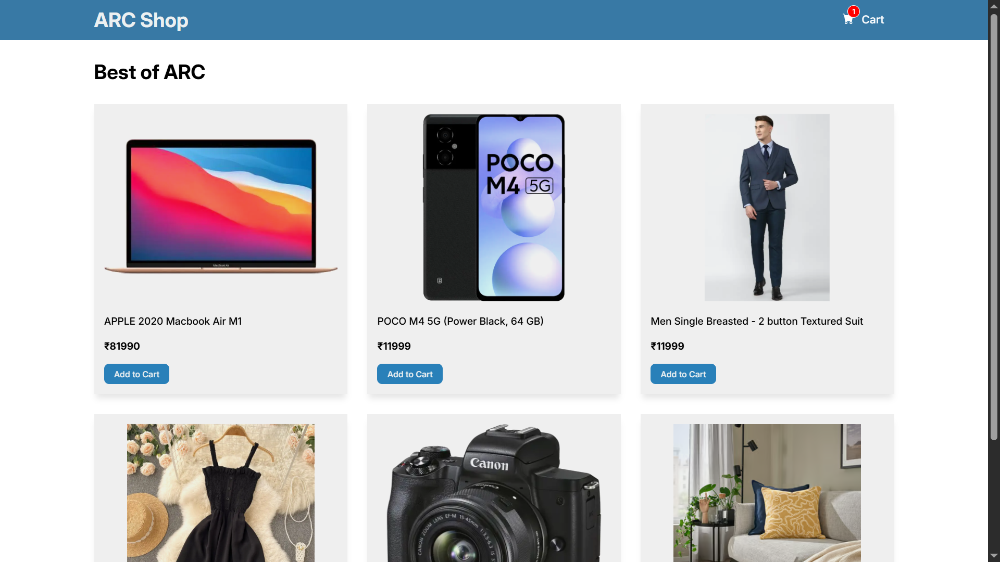
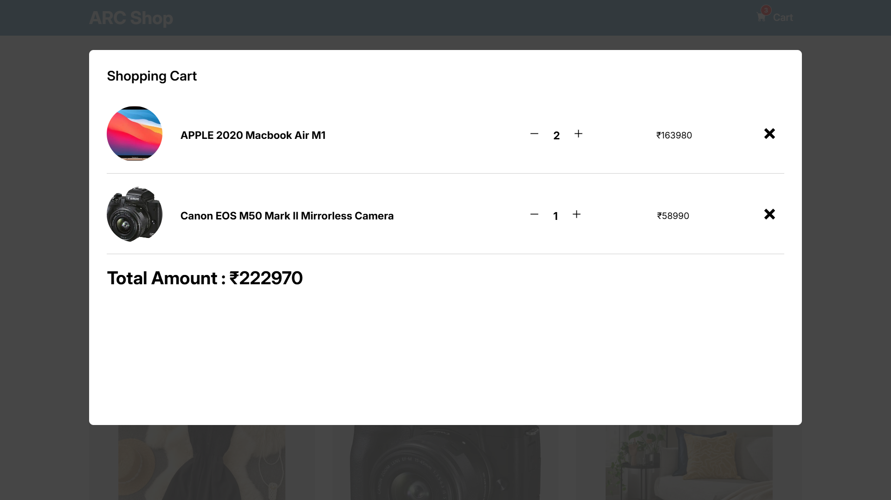

# 🛒 ARC Shopping Cart

A modern React-based shopping cart application built for learning and demonstrating advanced React concepts like state management, context API, reducers, and portals.

🔗 **Live Demo:** [https://arcshoppingcart.netlify.app/](https://arcshoppingcart.netlify.app/)

---

## 📸 Screenshots

### 🏠 Home Page



### 🛒 Cart Modal



---

## 🚀 Features

- Add items to cart
- Remove items from cart
- Increase / decrease item quantity
- Real-time total price calculation
- Cart modal using React Portal
- Toast notifications for user feedback
- Responsive design

---

## 🧠 Concepts Used

This project focuses on practical usage of core and advanced React patterns:

- `useReducer` → centralized state management
- `createContext` & `useContext` → global state sharing
- React Portal → modal rendering outside DOM hierarchy
- Component-based architecture
- Derived state (total amount, total quantity)

---

## 📁 Project Structure

```
src/
│
├── components/
│   ├── Header.jsx
│   ├── Products.jsx
│   ├── Product.jsx
│   └── UI/
│       ├── Cart.jsx
│       ├── CartItem.jsx
│       ├── Modal.jsx
│       └── Container.jsx
│
├── context/
│   └── CartProvider.jsx
│
├── data/
│   └── products.js
│
└── App.jsx
```

---

## ⚙️ Installation

Clone the repository and install dependencies:

```bash
git clone <your-repo-url>
cd arc-shopping-cart
npm install
npm run dev
```

---

## 📦 Dependencies

- React
- React DOM
- React Icons
- React Toastify

---

## 🧪 Future Improvements

- Persist cart data using localStorage
- Add authentication system
- Improve accessibility (keyboard navigation, focus trap)
- Add unit tests for reducer logic
- Convert project to TypeScript

---

## 🎯 Purpose

This project was built as a **learning + demonstration project** to understand how scalable state management works in React without external libraries.

---

## 👨‍💻 Author

Developed by **Aqib**

---
